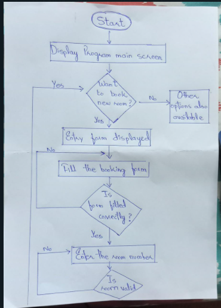
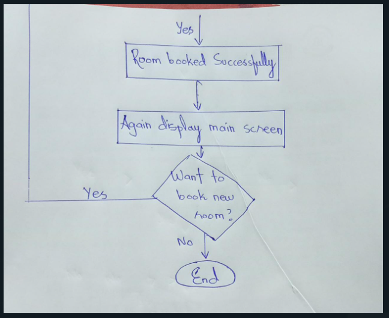
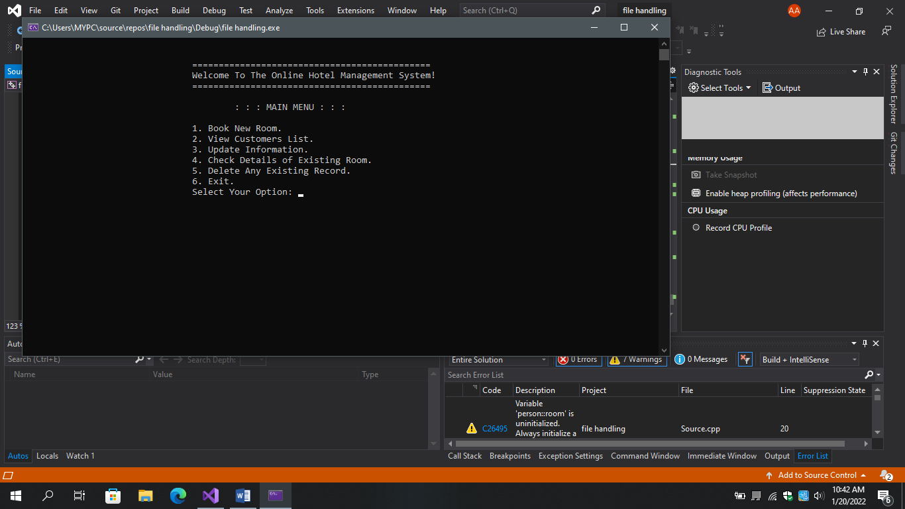
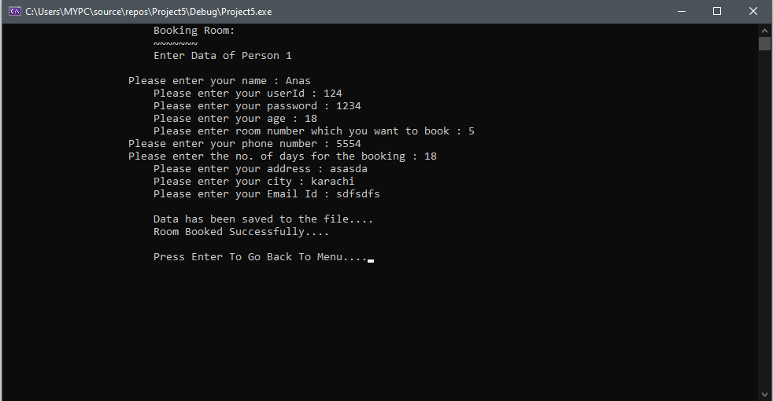
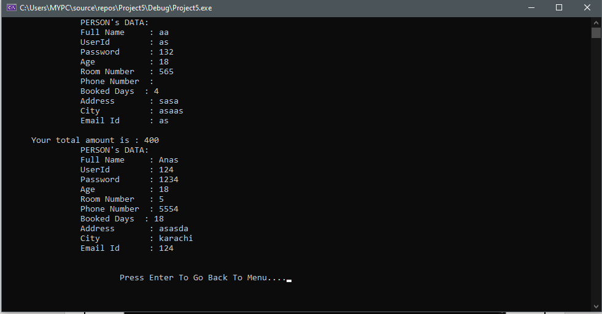
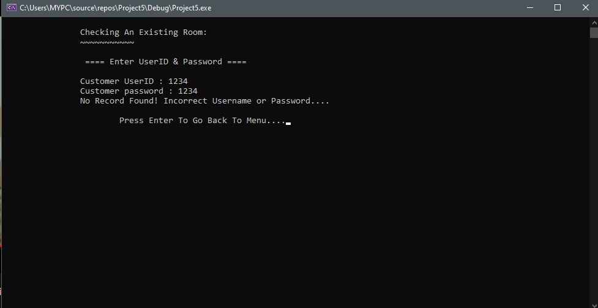
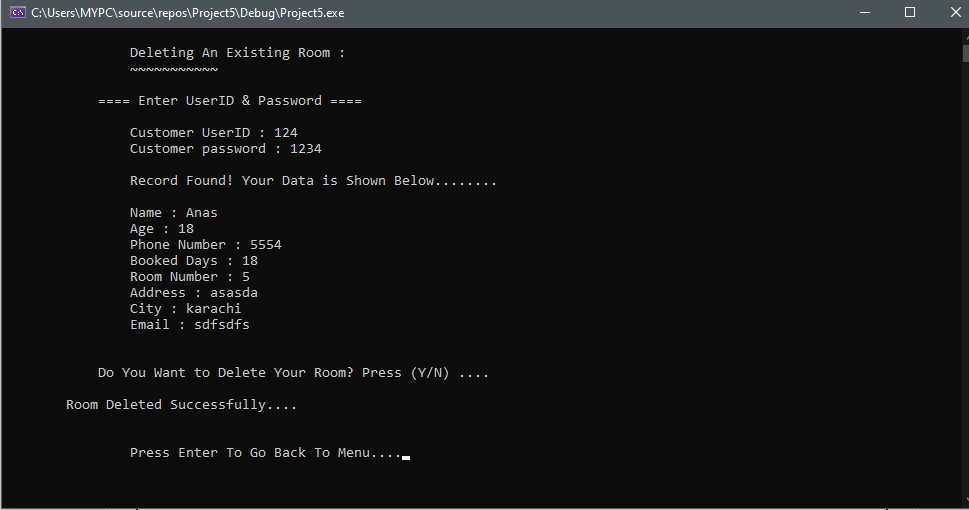
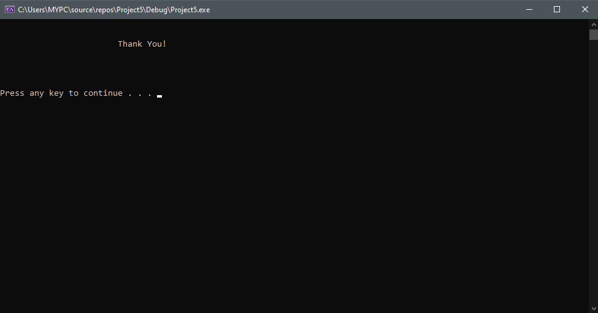

# 🏨 Restaurant & Hotel Management System

> A multi-modular, console-based management suite built in C++ featuring role-based authentication, interactive menu orders with automatic bill printing, lodging room reservation trackers, and a vehicle parking management pipeline.

[](https://isocpp.org/)
[](#)
[-darkgreen.svg?style=flat-square)](#)

---

## 🌟 Overview

The **Restaurant & Hotel Management System** is a complete console application built as a final project for the **Computer Programming (CP) Lab** course. It models a complex commercial system using arrays, structure formatting, file input/output streams, dynamic index mapping, and modular programming in C++.

The system uses role-based access control with specialized modules for **Administrator**, **Table Manager**, **Room Manager**, and **Parking Manager**. It tracks hotel resources (dining tables, guest rooms, parking slots) in real-time and persists the overall configuration state to an external `data.txt` file when shutting down.

---

## 📸 Console User Interface & Output Showcase

Here are the terminal execution logs showing role logins, table billing grids, room matrices, and parking allocations:

### 1. Main Welcome Screen & Credentials Login
<p align="center">
  
</p>

### 2. Table Manager Panel & Order Billing Output
<p align="center">
  
</p>

### 3. Room Booking Systems & Visual Status Grid
<p align="center">
  
</p>

### 4. Vehicle Parking Inventory & Record Controls
<p align="center">
   &nbsp;
  
</p>
<p align="center">
   &nbsp;
   &nbsp;
  
</p>

---

## ✨ Features

### 1. Role-Based Access Control (Authentication)
- Supports four specialized logins with individual credentials:
  - **Administrator** (`admin` / `admin123`) — Has complete access to all three sub-systems.
  - **Table Manager** (`table manager` / `tablemanager123`) — Manages restaurant dining.
  - **Room Manager** (`room manager` / `roommanager123`) — Manages room reservations.
  - **Parking Manager** (`parking manager` / `parkingmanager123`) — Manages vehicle slots.

### 2. Restaurant Table Management
- **30 Tables**: Supports dining orders for tables numbered 5 to 35.
- **Dynamic Billing**: Selects items from the restaurant menu and accumulates a running total:
  - Complete Breakfast — **$290**
  - Zinger Burger — **$240**
  - Chicken Biryani — **$150**
  - Broast — **$190**
  - Soft Drink — **$80**
- **Pictorial Table View**: Prints a detailed alignment layout showing `Table No.`, `Occupancy Status`, and `Total Bill` side-by-side.

### 3. Room Reservation Management
- **50 Total Rooms**: Separated into three comfort levels with hard-coded boundaries:
  - **10 VIP Lounges** (Rooms 1 to 10)
  - **15 First Class Rooms** (Rooms 11 to 25)
  - **25 Normal Rooms** (Rooms 26 to 50)
- **Controls**: Book rooms, cancel reservations, track totals, and view a visual 3-column room grid showing which slots are vacant/occupied.

### 4. Parking Lot Management
- **100 Vehicle Capacity**: Multi-lane parking allocation system supporting three vehicle classes:
  - **50 Cars** (10 per lane, lanes C1 to C5)
  - **20 Buses** (10 per lane, lanes B1 to B2)
  - **30 Motorbikes** (10 per lane, lanes M1 to M3)
- **Controls**: Park vehicle, remove vehicle, and print total parking stats.

### 5. Flat-File Persistence
- Saves current room and table allocation arrays to `data.txt` on exit.
- Reads and prints the saved configurations to restore the system state on start.

---

## 🛠️ Technical Implementation details

- **Structure Encapsulation**: A global struct `manage` groups system allocations:
  ```cpp
  struct manage {
      string state[50];  // Lodging room states (occupied/vacant)
      string status[35]; // Dining table states
      int table[35];     // Table bills
  };
  ```
- **I/O Streams**: Integrates `<fstream>` libraries (`ofstream myfile` and `ifstream readfile`) to manage database writes.
- **Console Manipulation**: Leverages `<iomanip>` tools (`setw`) to align outputs into readable table grids.

---

## 📁 Project Structure

```
Hotel_C-/
│
├── hotel_management.cpp    # Main C++ source file containing structures and logic flows
├── data.txt                # External database file saving system allocations
├── CP LAB PROJECT.docx     # Project proposal document
├── CP LAB REPORT.docx      # Lab submission report with schematics
├── Proposal-form-24122021-055456pm.docx # Project proposal form
├── screenshots/
│   ├── screenshot_1.jpg    # Room booking flow chart
│   ├── screenshot_2.png    # Login panel
│   ├── screenshot_3.png    # Table manager & menu pricing
│   ├── screenshot_4.png    # Administrator control logs
│   ├── screenshot_5.png    # Parking manager lanes printout
│   ├── screenshot_6.png    # Vehicle removal interface
│   ├── screenshot_7.png    # Parking occupancy logs
│   ├── screenshot_8.png    # Parking rules warning
│   ├── screenshot_9.png    # Log out menu
│   └── screenshot_10.png   # Room manager reservation interface
└── README.md
```

---

## ⚙️ How It Works

```
System launches
      ↓
Loads status configurations from data.txt
      ↓
User authenticates (Admin / Table Manager / Room Manager / Parking Manager)
      ↓
Toggles sub-system loops:
  - Table Management   → Add/remove menu items, compute bills, print table grid
  - Room Management    → Reserve/cancel rooms (VIP/First/Normal), print room matrix
  - Parking Management → Park/remove vehicles (Cars/Buses/Bikes), track lanes
      ↓
User logs out → writes status arrays back to data.txt
```

---

## 🚀 Getting Started

### Prerequisites
- A **C++ Compiler** (GCC / MinGW, MSVC, or Clang) supporting C++11 or higher.

### Run the System

**1. Clone the Repository:**
```bash
git clone https://github.com/AnasQ2003/Hotel_C-.git
cd Hotel_C-
```

**2. Compile the Source Code:**
```bash
g++ -std=c++11 hotel_management.cpp -o hotel_management
```

**3. Launch the Executable:**
```bash
./hotel_management
```

---

## 💡 Key Concepts Demonstrated

| Concept | How It's Used |
| :--- | :--- |
| **Structures** | `struct manage` groups system states in unified structs |
| **Arrays & Indexing** | Tracks 50 room configurations and 35 table records using index arrays |
| **Console Formatting**| `setw` forces columns to line up in tables |
| **File I/O Streams** | `ofstream` writes arrays to `data.txt`; `ifstream` parses them back on launch |
| **Conditional Switches**| `switch/case` structures menu selection pathways cleanly |
| **Boolean Flags** | Loop control flags (`bool j, k, l`) drive menus securely |

---

## 🧠 Learning Objectives 
> ✅ **Objective**: Apply core C++ syntax — including structs, arrays, loops, I/O streams, and console formatting — to construct a multi-modular desktop simulation that mimics a business environment.

**Activities Completed:**
- ✔️ Formatted structured console menus with user inputs.
- ✔️ Structured state-tracking variables into single data structures using `struct`.
- ✔️ Integrated flat-file databases to persist user selections across sessions.
- ✔️ Handled index-specific calculations to update totals and states dynamically.
- ✔️ Aligned reports in terminal screens using formatting libraries (`setw`).

**Key Takeaways:**
- Modular programming keeps large source files organized and maintainable.
- Structures (`struct`) are perfect for grouping multiple variables of different types.
- Input validation on console prompts is critical to prevent infinite loops.
- File storage keeps applications useful across process lifetimes.

---

## 📄 License

```
MIT License

Copyright (c) Hotel-Management-System-C ---2026 AnasQ2003

Permission is hereby granted, free of charge, to any person obtaining a copy
of this software and associated documentation files (the "Software"), to deal
in the Software without restriction, including without limitation the rights
to use, copy, modify, merge, publish, distribute, sublicense, and/or sell
copies of the Software, and to permit persons to whom the Software is
furnished to do so, subject to the following conditions:

The above copyright notice and this permission notice shall be included in all
copies or substantial portions of the Software.

THE SOFTWARE IS PROVIDED "AS IS", WITHOUT WARRANTY OF ANY KIND, EXPRESS OR
IMPLIED, INCLUDING BUT NOT LIMITED TO THE WARRANTIES OF MERCHANTABILITY,
FITNESS FOR A PARTICULAR PURPOSE AND NONINFRINGEMENT.
```

---

## 👨‍💻 Author

**Anas Ahmed Qureshi.** — [@AnasQ2003](https://github.com/AnasQ2003)

---

<div align="center">
  <p>Built with ❤️ by <strong>Anas</strong></p>
  
 <div align="center">

Made with 💧 and a lot of ☕

**⭐ If you found this useful, please star the repository!**

*Stay hydrated. Stay healthy.*

</div>
<div align="center">
  <p>Built with ❤️ using C++</p>

  **⭐ If this lab project was helpful, please star the repository!**
</div>
